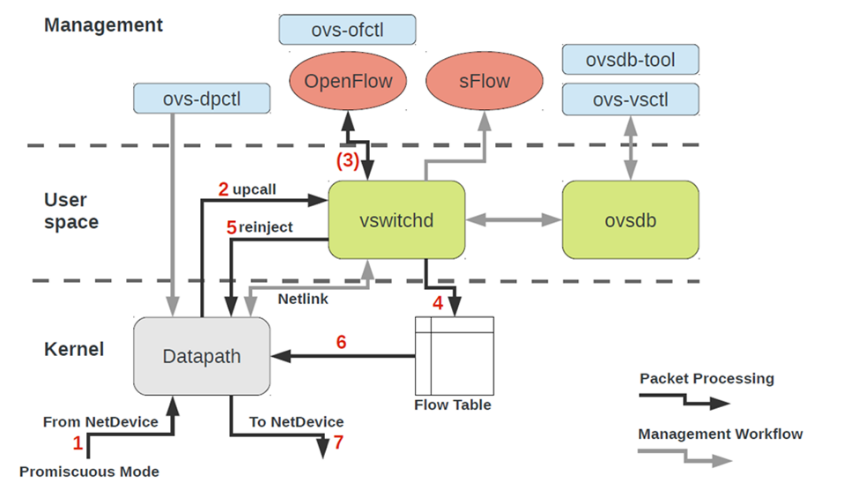
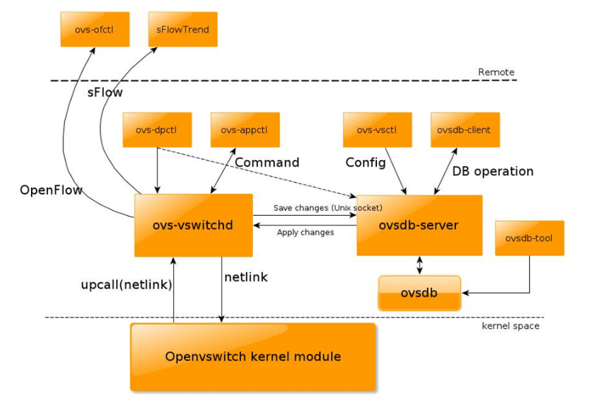
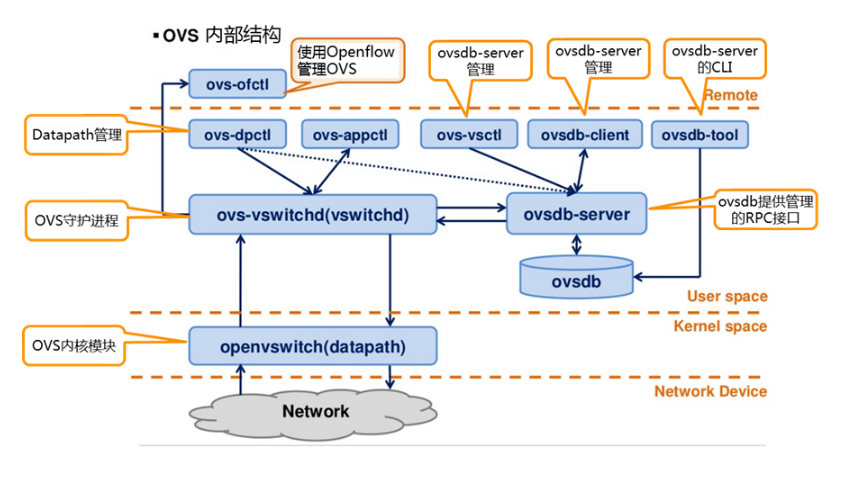
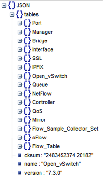
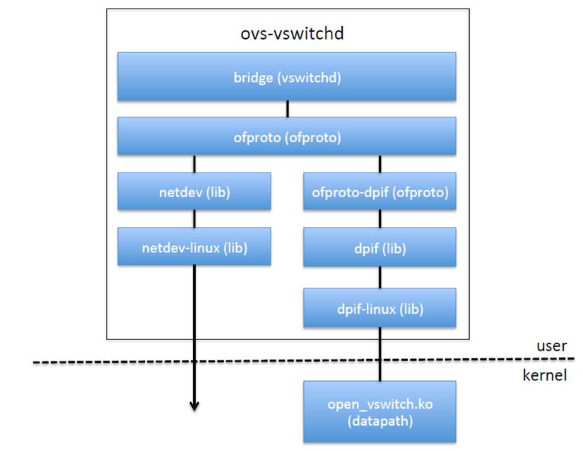
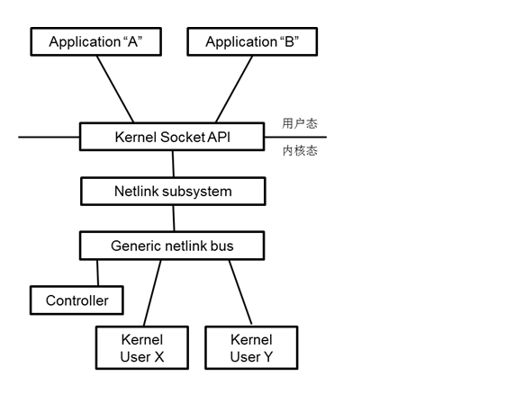

# TÌM HIỂU CẤU TRÚC CỦA OPEN VSWITCH

### ***Mục lục***

[1. Cấu trúc - thành phần]


<a name = '1'></a>
# 1.	Cấu trúc – thành phần

Cấu trúc của OVS được mô tả như trong các hình sau:







Mỗi module thành phần của OVS giữ một vai trò khác nhau. 

<a name = '1.1'></a>
## 1.1.	ovs-vswitchd

- Là module chính, đóng vai trò là daemon của OVS, switch thực hiện các chức năng chuyển mạch kết hợp với module trong kernel Linux cho flow-based swtiching.

- Trên máy chủ cài OVS sử dụng `ps aux` để xem được thông tin tiến trình của **ovs-vswitchd** như sau:

	```
	root 16399 0.0 3.3 246332 33548 ? S<Ll 14:43 0:01 ovs-vswitchd unix: /var/run/openvswitch/db.sock -vconsole:emer -vsyslog:err -vfile:info --mlockall --no-chdir --log-file=/var/log/openvswitch/ovs-vswitchd.log --pidfile=/var/run/openvswitch/ovs-vswitchd.pid --detach --monitor
	```

- Ở đây, **ovs-vswitchd** lắng nghe trên file `db.sock`.

<a name = '1.2'></a>
## 1.2.	openvswitch.ko

- Là module kernel của linux hỗ trợ trao đổi dòng dữ liệu trong kernel.

- Sử dụng `lsmod` để liệt kê các module được tải vào trong kernel: 

	```
	# lsmod | grep openvswitch
	openvswitch            98304  3 vport_vxlan
	nf_defrag_ipv6         36864  1 openvswitch
	nf_conntrack          106496  1 openvswitch
	libcrc32c              16384  1 openvswitch
	```
<a name = '1.3'></a>
## 1.3.	ovsdb-server 

- Là một máy chủ database nhẹ, lưu các thông tin cấu hình, **ovs-vswitchd** thông qua cơ sở dữ liệu này để lấy các thông tin cấu hình.

- Sử dụng `ps aux` để xem thông tin tiến trình của **ovsdb-server**:

	```
	root 16381 0.0 0.0 19972 360 ? S<s 14:43 0:00 ovsdb-server: monitoring pid 16382 (healthy)
	root 16382 0.0 0.4 20340 4432 ? S< 14:43 0:00 ovsdb-server /etc/openvswitch/conf.db -vconsole:emer -vsyslog:err -vfile:info --remote=punix:/var/run/openvswitch/db.sock --private-key=db:Open_vSwitch,SSL,private_key --certificate=db:Open_vSwitch,SSL,certificate --bootstrap-ca-cert=db:Open_vSwitch,SSL,ca_cert --no-chdir --log-file=/var/log/openvswitch/ovsdb-server.log --pidfile=/var/run/openvswitch/ovsdb-server.pid --detach --monitor
	```

- **ovsdb-server** lưu thông tin cấu hình trong file `conf.db` và các dịch vụ thông qua `db.sock`, và ovs-vswitch đọc các thông tin cấu hình từ tiến trình này thông qua `db.sock`.

- File `/etc/openvswitch/conf.db` là định dạng json, có thể in ra cấu trúc cơ sở dữ liệu sử dụng lệnh `ovsdb-client dump`.

- Cấu trúc database chứa các bảng sau:

	

- Cấu trúc dữ liệu như sau:

	


- Tất cả các bridge và network card được tạo bởi `ovs-vsctl` được lưu trong database, **ovs-vswitchd** sẽ tạo một bridge thật và network theo như cấu hình trong database.

- **ovs-dpctl** được sử dụng để cấu hình switch kernel module.

- **ovs-vsctl**: truy vấn và cập nhật cấu hình của ovs-vswitchd.

- **ovs-ofctl**: truy vấn và điểu khiển OpenFlow và controller.

- **ovs-appctl**: gửi các thông điệp lệnh, chạy các daemon liên quan.

<a name = '2'></a>
# 2.	Cấu trúc code của OVS

- Logic luồng dữ liệu trong **ovs-vswitchd** và **openvswitch.ko** như sau:

	

- ovs-vswitchd đọc cấu hình từ ovsdb-server và gọi tới lớp ofproto để tạo một NIC ảo hoặc stream table.

- Ofproto là thư viện thực hiện chuyển mạch mềm và các hoạt động qua lại trong bảng.

- Lớp trừu tượng Netdev trong thiết bị mạng kết nối tới switch ảo.

- Lớp dpif thực hiện các hoạt động của flow table.

- Với OVS, có các loại network card như sau:

	1) ***netdev***: kiểu card mạng thông thường: eth0, veth.
		
		Nhận: là một thiết bị nhận các gói tin chuyển trực tiếp ở L2 thông qua xử lý chức năng nhận của OVS, sẽ không đưa tới protocol stack kernel truyền thống.

		Gửi: OVS trong một luồn xác định từ netdev do thiết bị card mạng để gửi đi.

	2) ***Internal***: Một thiết bị card mạng ảo.

		Nhận: gói tin định tuyến gửi từ hệ thống gửi thông qua thiết bị để vào chức năng xử lý nhận của ovs.

		Gửi: Luồng trong OVS đích đến được gửi từ thiết bị nội bộ khi bản tin được gửi lại vào trong kernel protocol stack.

	3) ***gre device***: Không liên quan tới có bao nhiêu tunnle gre được tạo trong usermode, chỉ có một thiết bị gre trong kernel state.
	
		Nhận: Khi hệ thống nhận được bản tin của gre, được qua lớp L4 phân tích gre header, và rồi đưa tới chức năng xử lý nhận của OVS.
		
		Gửi: ovs trong luồn từ thiết bị gre để gửi, bản tin sẽ dựa trên các quy tắc trong bảng flow thêm vào phần gre header và outer ip, tìm định tuyến để gửi.

<a name = '3'></a>
# 3.	ovs-vswitchd và openvswitch.ko tương tác thông qua netlink

- datapath chạy trong kernel mode, ovs-vswitch chạy trong user mode, và cả hai tương tác thông qua netlink.



- Netlink là một cơ chế xử lý liên quá trình truyền thông linh hoạt và mạnh mẽ mà có thể truyền thông cả user và kernel mode.

- netlink hoạt động full duplex. Như socket, netlink có họ địa chỉ với AF_NETLINK (TCP/IP socket có họ là AF_INET)

- Hiện tại có rất nhiều kịch bản truyền thông sử dụng netlink, những mở rộng cụ thể và thiết kế của bus truyền thông netlink được định nghĩa là họ với nhau. Chẳng hạn như NETLINK_ROUTE, NETLINK_FIREWALL, NETLINK_ARPD và hơn nữa.

- Bởi số lượng lớn các họ  sẽ chiếm id họ, và id họ tự nó là hạn chế (kernel cho phép 32); đồng thời sự thuận lợi của người dùng khi mở rộng khả năng sử dụng họ netlink thông thường được xác định, đây là họ netlink cơ bản.
